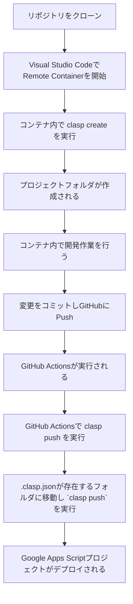

# docker-clasp-starter

チームで GAS を管理するための環境を簡単に整えるためのリポジトリです

# このリポジトリを使った GAS 開発の大まかな流れ



# 使い方

## 0. テンプレートからリポジトリを作成する

このリポジトリはテンプレートリポジトリになっています。
Mit ライセンスで公開していますが、通常チームでこのリポジトリを用いて開発する場合、プライベートリポジトリでやるはずなので、Fork ではなくこのレポジトリをテンプレートとしてリポジトリを作成してください。

## 1. リポジトリをクローンする

リポジトリを作成後ローカルにクローンして、ディレクトリに移動します。

```bash
git clone
cd docker-clasp-starter
```

## Visual Studio Code でコンテナを開く

Visual Studio Code プロジェクトを開きます。

```bash
code .
```

Cmd + Shift + P でコマンドパレットを開き、`Remote-Containers: Reopen in Container`を選択します。

コンテナが開いたら、 `postCreateCommand` によって自動で `npm install` されます。

## コンテナ内で clasp をセットアップする

### clasp login

```bash
clasp login
```

## プロジェクトフォルダとプロジェクトを作成

```bash
npm run create [project_name]
```

これを実行することによって [clasp-script.sh](https://github.com/Studist/docker-clasp-starter/blob/main/clasp-script.sh) が動き、`project_name` という名前のフォルダが作成され、以下のツリー構造でプロジェクトが作成されます。

```bash
project_name
├── src
│   └── appsscript.json
└── .clasp.json
```

そして、タイムゾーンが日本に設定されます。
project_name は任意の名前を指定してください。すでに存在するフォルダ名を指定すると、エラーが発生します。
直接 clasp を実行してしまうと、上記の処理が行われないので、必ず `npm run create [project_name]` を実行してください。

## 作成したフォルダに移動して開発

```bash
cd project_name
touch ./src/code.gs
```

Typescript を使う場合は、以下のような `./src/code.ts` を作成します。

### Push したい場合

Git リポジトリを Push すると GitHubActions で `clasp push` が行われますが、コンテナ内から直接 `clasp push` を実行することもできます。
ただし、 `package.json` が `project_name` フォルダに存在しない場合エラーになるので、これも Clone と同様に `npm run push project_name` を実行してください。
どこのディレクトリにいても `project_name` のプロジェクトを明示的に Push できます。

## GitHub Actions 用の環境変数を設定する

コンテナ内で `clasp login` を実行すると、`/home/node/.clasprc.json.` が作成されます。

このファイルを `cat` し、出力を全てコピーして GitHub のリポジトリの [Settings] => [Secrets and variables] => [Actions] => [New repository secret] に `CLASP_TOKEN` という名前で作成します。

```bash
cat /home/node/.clasprc.json
```

## 開発が終わったらプッシュ

リポジトリをプッシュすると、GitHub Actions で `.clasp.json` があるフォルダを全て探して、それぞれのフォルダで `clasp push` が行われます。

# 補足

## コンテナ内で `clasp login` を実行する理由

`clasp login` は必ずコンテナ内で行わないといけないわけではありません。別の端末などで作った `.clasprc.json` の内容を `CLASP_TOKEN` に設定しても構いませんし、手打ちでプロジェクトフォルダや `.clasp.json` を作っても構いません。
Clasp の開発環境セットアップや、プロジェクトの作成などを誰でもできるように、コンテナ内で行うように記載しております。

## `project1` フォルダはなんのためにあるの？

`project1` フォルダはツリー構造を示すためのサンプルプロジェクトです。
不要であれば削除してください。

## TypeScript を使う場合

以下のドキュメントを参考に `tsconfig.json` を編集してください。
https://github.com/google/clasp/blob/master/docs/typescript.md
